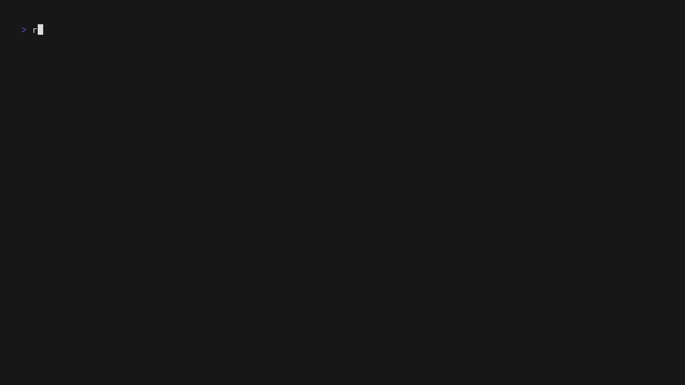

<h1 align="center">rgd</h1>

<p align="center">Installed game detection utility for Linux. Built to be simple and scriptable.</p>

<p align="center">
  
  
  <a href="https://crates.io/crates/rgd"></a>
  <a href="https://aur.archlinux.org/packages/rgd"></a>
</p>


<p align="center"><em>Can you tell I'm not a graphic designer?</em></p>

## About

This utility is a CLI front-end for [lib_game_detector](https://github.com/Rolv-Apneseth/lib_game_detector). It is
intended to be used in scripts, especially with picker programs (e.g. `rofi`, `dmenu`, `fzf`,
etc.) in order to launch games, or perform some other action with the game's details.

### Why

I find that searching for games from different sources (e.g. Steam, Heroic, Lutris) is _slow_, as is
just visually searching through a UI. However, detecting games with this tool is _fast_ (~3ms on my machine™),
as is searching through those games using fuzzy search. This allows me to waste less time _looking_ for what game I
want to play, and more time actually _playing_.

This program in particular is made as a more basic alternative to another project of mine, [rofi-games](https://github.com/Rolv-Apneseth/rofi-games),
making it more universally useful. It is very scriptable and can be used with any picker. Check out
the [extras](./extras) directory for some examples.

### Name

Simply named for the short acronym that isn't used by anything else I'm familiar with: **R**olv's **G**ame **D**etector.

## Installation

<details>
<summary><strong>Cargo</strong></summary>

```bash
cargo install rgd --locked
```

Or, directly from source:

```bash
cargo install --git https://github.com/rolv-apneseth/rgd --locked
```

</details>

<details>
<summary><strong>AUR</strong></summary>

```bash
paru -S rgd
```

</details>

<details>
<summary><strong>Manual</strong></summary>

1. Download the tarball corresponding to your computer's architecture (probably `x86_64`) from the [releases page](https://github.com/Rolv-Apneseth/rgd/releases)
2. Unpack the tarball, e.g.:

    ```sh
    tar -xf rgd-x86_64-unknown-linux-gnu.tar.gz
    ```

3. Place the `rgd` binary in your `$PATH`

</details>

## Usage



#### List the titles and launch commands of all detected games

```sh
rgd list
```

#### List all detected games, showing only their titles

```sh
rgd list --fields="title"
```

#### List all detected games from Steam, along with the paths to their icons

```sh
rgd list --fields="title,path-icon" --source "steam"
```

#### List details for all detected games as prettified JSON

```sh
rgd list --json | jq
```

#### Launch a game selected through `fzf`

```sh
sh -c "$(rgd list | fzf -d $'\t' --with-nth 1 | cut -d$'\t' -f2)"
```

#### Open the root directory for a game with a given title

```sh
rgd get --fields="path-game-dir" "the finals" | xdg-open
```

Note: the matching is case-insensitive

#### Additional information

- Logs are written to `$XDG_STATE_HOME/rgd/logs`
- Log level can be changed using the `RUST_LOG` env var, e.g. `RUST_LOG="trace"`

## Picker Examples

Examples of basic setups to launch games with different picker programs. You can find more useful
scripts in the [extras](./extras) directory - treat the below as a quickstart.

<details>
<summary>dmenu</summary>

```sh
sh -c "$(rgd list --fields="title" | dmenu -i | rgd get --fields="launch-command")"
```

</details>

<details>
<summary>fzf</summary>

```sh
sh -c "$(rgd list | fzf -d $'\t' --with-nth 1 | cut -d$'\t' -f2)"
```

</details>

<details>
<summary>rofi</summary>

```sh
sh -c "$(rgd list | rofi -dmenu -display-columns 1 -i | cut -d$'\t' -f2)"
```

</details>

<details>
<summary>fuzzel</summary>

```sh
sh -c "$(rgd list | fuzzel --dmenu --counter --with-nth 1 | cut -d$'\t' -f2)"
```

</details>

<details>
<summary>wofi</summary>

```sh
sh -c "$(rgd list | wofi -i --dmenu --pre-display-cmd="echo \"text:%s:\" | cut -f1" | cut -f2)"
```

</details>

<details>
<summary>bemenu</summary>

```sh
sh -c "$(rgd list --fields="title" | bemenu --list 10 --ignorecase | rgd get --fields="launch-command")"
```

</details>

<details>
<summary>tofi</summary>

```sh
sh -c "$(rgd list --fields="title" | tofi | rgd get --fields="launch-command")"
```

</details>

<details>
<summary>yofi</summary>

```sh
sh -c "$(rgd list --fields="title" | yofi dialog | rgd get --fields="launch-command")"
```

</details>

## Contributing

All contributions are welcome. If you run into any problems, or have any suggestions/feedback, feel
free to open an issue.

Note, however, that for e.g. support for additional launchers/sources, or game(s) not being
detected, [lib_game_detector](https://github.com/Rolv-Apneseth/lib_game_detector) is the correct
place to open an issue.

### Building

This project is written in Rust, so for contributing features / fixes:

1. Ensure [rustup](https://rustup.rs/) is installed - this project uses the stable toolchain for
   most things, but nightly for the formatting.
2. Make your changes and ensure they work as expected - `cargo run -- your_args_here`.
3. Lint + format + run tests:

    ```rust
    cargo clippy --all -- -W clippy::all && cargo +nightly fmt && cargo test
    ```

I like [just](https://github.com/casey/just), so I keep some utility commands in the [justfile](./justfile).
Check that out for additional checks which are run in the CI.

## Similar programs

- [rofi-games](https://github.com/Rolv-Apneseth/rofi-games): if you use `rofi`, it's worth checking out.
  Additional features include sorting based on access and a full configuration
  file for modifying detected games, or adding fully custom entries to the list.

## Acknowledgements

- All the [dependencies](./Cargo.toml) of this project, and all [their dependencies](./Cargo.lock) too.
This would not be possible without the fantastic Rust ecosystem.

## License

This code is licensed under the [AGPLv3](https://www.gnu.org/licenses/agpl-3.0.en.html#license-text).

See the [LICENSE](./LICENSE) file for more details.
